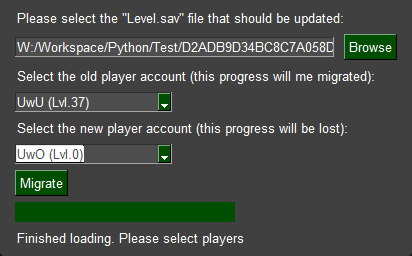

# Palworld Host Save Fix

> ### :bangbang: This tool was developed for an earlier version of Palworld and might not work on the current version, *always* make a backup before using this tool.

> ### :warning: This tool is experimental. Be careful of data loss and *always* make a backup.

## Information

Fixes the bug which forces a player to create a new character when they already have a save.

Palworld save files are different depending on the type of server you are running. Co-op, Windows dedicated server, Linux dedicated server, SteamCMD dedicated server, all of these are different types of Palworld servers and if you try to migrate a save file from one type of server to another, you can run into a player save bug which forces you to create a new character.

For example:
- Moving a Windows co-op save to a Windows dedicated server will force the host to create a new character and lose their save.
- Moving a Windows dedicated server save to a Linux dedicated server will force all players to create a new character and lose their save.
- Moving a Linux dedicated server save to a Windows dedicated server will force all players to create a new character and lose their save.
- Moving a Windows co-op save to a Linux dedicated server will force all players to create a new character and lose their save.
- Etc.

The bug happens because players are identified and correlated to their save via their GUID. These different types of servers generate player GUIDs differently so when a player joins, the server generates a new GUID that doesn't match the old save's GUID and because of this, doesn't realize the player already has a save.

To fix this bug, we've made a script that takes the GUID of the player on the new server and applies it to the player save from the old server so that the new server will use the player save from the old server.

## Usage

Steps:
1. **Copy** (This is an experimental script and has known bugs so always keep a backup copy of your save.) your desired save's folder from `C:\Users\<username>\AppData\Local\Pal\Saved\SaveGames\<random_numbers>` to your dedicated server.
2. In the `PalServer\Pal\Saved\Config\WindowsServer\GameUserSettings.ini` file, change the `DedicatedServerName` to match your save's folder name. For example, if your save's folder name is `2E85FD38BAA792EB1D4C09386F3A3CDA`, the `DedicatedServerName` changes to `DedicatedServerName=2E85FD38BAA792EB1D4C09386F3A3CDA`.
3. Delete `PalServer\Pal\Saved\SaveGames\0\<your_save_here>\WorldOption.sav` to allow modification of `PalWorldSettings.ini`. Players will have to choose their respawn point again, but nothing else is affected as far as I can tell.
4. Confirm you can connect to your save on the dedicated server and that the world is the one in the save.
5. Afterwards, create a new character on the dedicated server. A new `.sav` file should appear in `PalServer\Pal\Saved\SaveGames\0\<your_save_here>\Players`.
6. The name of that new `.sav` file is the co-op host's new GUID.  Shut the server down and follow the next instructions using the GUI (easy) or the Terminal (hard) approch. Remember this GUID for the Terminal approach.

### GUI
Download and run the .exe found in the [latest realese](https://github.com/JannikBirn/palworld-host-save-fix/releases). Start the .exe and follow the next instructions. **(If the GUI is sometimes not responding, just wait it out, it is duing some expansive IO operations and will finsih)**

Select the Level.sav file **of your Server**.

Select the first player by the name and lvl, this character will be migrated. In the second Dropdown select the newly created player (it will probably be lvl.0 if you havn't done anything). After that click on "Migrate" (This might take a while, don't close the window if it is not responding, the program is working in the background).

### Terminal

You will require palworld-save-tools. This will be automatically downloaded if you clone this repository.

Dependencies:
- Python 3
- [palworld-save-tools](https://github.com/cheahjs/palworld-save-tools)

Command:    
`python fix-host-save.py <save_path> <new_guid> <old_guid>`
`<save_path>` - Path to your save folder    
`<new_guid>` - GUID of the player on the new server    
`<old_guid>` - GUID of the player from the old server

Example:    
`python fix-host-save.py "C:\Users\XXX\Desktop\my_temporary_folder\2E85FD38BAA792EB1D4C09386F3A3CDA" 6E80B1A6000000000000000000000000 00000000000000000000000000000001`

7. Copy the entire dedicated server save at `PalServer\Pal\Saved\SaveGames\0\<your_save_here>` (it must be the save with the co-op host's new character!) into a temporary folder and remember the path for the temporary folder because it's needed to run the script.
9. Run the script using the command in the [Terminal](#Terminal) with the information you've gathered and using `00000000000000000000000000000001` as the co-op host's old GUID.
10. Copy the save from the temporary folder back to the dedicated server. Move the save you had in the dedicated server somewhere else or rename it to something different.
11. Start the server back up and have the co-op host join the server with their fixed character.
12. If, after 5 minutes of play, your Pals won't attack for you or do work in the base, follow the [\[Pal bug\] workaround](#pal-bug) to fix them.

### Multible Players have different Characters
If multible players received a new character you can repeat this process multible times and migrate them one by one.

## Known bugs

### ~~\[Left Click bug\]~~

**Has been fixed in the newest version of the script. If you aldready run the script and can't go to a previous version of the save file you need to fix it manually right now, here is a description of the process: [Issue #6](https://github.com/JannikBirn/palworld-host-save-fix/issues/6#issuecomment-1913631932)**

~~Details: After applying the fix, some players experience a bug where you can't hold your left mouse button to attack. It seems like this only happens if you didn't do the [\[Guild bug\] workaround](#guild-bug) but I'm not sure.~~

~~Workaround: If you leave the guild and rejoin, it goes away. Thanks [/u/skalibran](https://www.reddit.com/r/Palworld/comments/19axeqs/autoswing_not_working/kiq85zr/)!~~

### ~~\[Guild bug\]~~

**\*\* Has likely been fixed by https://github.com/xNul/palworld-host-save-fix/pull/18. \*\***

~~Details: Guild membership doesn't work properly after fixing a character. This is likely happening because there's some guild configuration being missed in the character migration from the old save to the new save.~~

~~Workaround: \[Co-op Only\] In co-op, before moving the save, transfer ownership from the co-op host's character to another character and have the co-op host's character leave the guild. Fixes the issue entirely. Doesn't work when all players lose their save data because there is no working player to hold the guild.~~

### \[Pal bug\]

Details: Pals owned by the player won't do anything at the base. This is likely caused by the Pals not being registered with the correct guild.

Workaround: On the new server, after the save has been fixed, have each player's character go into their base, drop on the ground and pick up every single Pal they own, including the base workers. This can be done using the "Drop" button in the Party menu. This will re-register the Pals with the correct guild and fix the issue entirely.

### \[Viewing Cage bug\]

Details: The Viewing Cage [isn't officially supported](https://tech.palworldgame.com/dedicated-server-guide#qa) on dedicated servers so if you have built one in co-op, it needs to be removed from your co-op save before migrating it to your dedicated server.

Workaround: \[Co-op Only\] If you have built a Viewing Cage, it needs to be removed from your co-op save before migrating it to your dedicated server.

### Credit to [xNul](https://github.com/xNul/palworld-host-save-fix) and his Palworld Host Save Fix that was used as a base for this repo.
This repository was created to fix the issue ([#69](https://github.com/xNul/palworld-host-save-fix/issues/69)) of not being able to pick up pals after the execution of his tool. Because a decend amount of changes were made i decided to create a new repository instead of creating a PR. 

### Appreciate any help testing and resolving bugs.